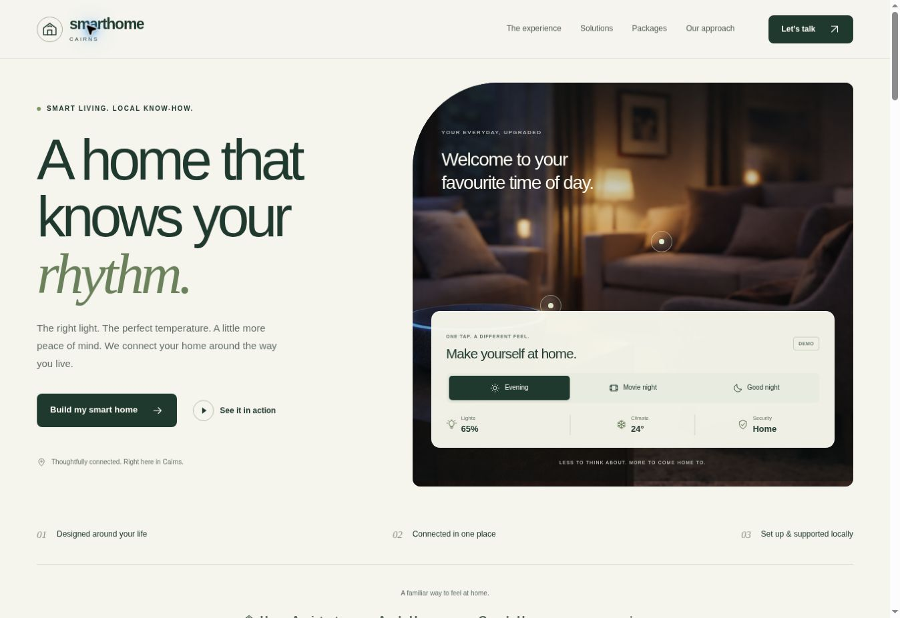

# SmartHome Cairns redesign

Review the redesign at https://saro8998.github.io/smarthome/redesign/.

This is a dependency-free, responsive static site. The existing homepage remains at the repository root for comparison. The redesign is marked `noindex` until it becomes the main site.

## Files

- `index.html`: page content, existing pricing, lead form and accessible controls.
- `styles.css`: responsive layout, typography and reduced-motion support.
- `app.js`: illustrative home scenes, video tabs, wish-list selection and enquiry handling.
- `assets/`: favicon and video poster frames extracted from the original demonstration clips.

The photos and four MP4 clips reference the original assets one directory above. No video is automatically downloaded or played on page load. Videos have native playback controls and direct file links.

## Enquiries

The enquiry form uses the existing site's Formspree endpoint: `https://formspree.io/f/xjgqbbdq`. Selected features and packages are included as `selected_features` and `selected_package`. Contact details are not stored locally. Only the non-personal wish-list selection is saved in the visitor's browser. On submission errors, form values remain in place for retry. A honeypot field helps with basic spam filtering.

The form also supports standard HTML POST submission when JavaScript is unavailable. No fabricated reviews, customer counts or performance guarantees were added. The hero controls are explicitly labelled as a demonstration.

## Local preview

Run `python -m http.server 8080` from the repository root, then visit `http://localhost:8080/redesign/`.

## Publishing

The repository's existing GitHub Pages deployment publishes the `redesign/` folder alongside the original homepage. No build tooling or extra service is required. To adopt this as the main homepage later, adjust the asset paths and remove the preview's `noindex` tag.

## Review and verification

Open `preview.html` to review the site in mobile, tablet and desktop frames. The preview wrapper is separate from the customer-facing site.

Verified in a browser: all four original videos reach playback-ready state; hero scene controls update; the mobile menu opens and closes on navigation; feature selection, removal and clearing work; package choices appear in the enquiry area. Desktop, mobile (375px usable width) and tablet (805px usable width) layouts were checked for horizontal clipping. Required form fields are present. No live enquiry was submitted, so actual inbox delivery has not been tested.

